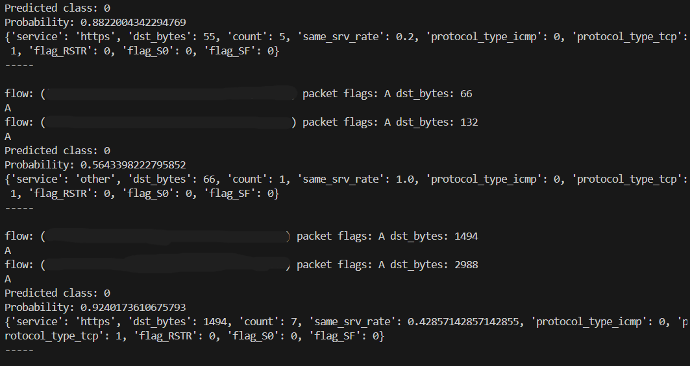

# IDS Project

This project implements a **real-time Intrusion Detection System (IDS)** using Python. It captures network packets using **Scapy**, calculates statistics and flow features, and performs predictions with machine learning models.  

The system is **[multithreaded](https://www.freecodecamp.org/news/build-a-real-time-intrusion-detection-system-with-python/)**, allowing it to sniff network packets while simultaneously computing flow statistics and performing predictions.

---

## Dataset & Training

The models were trained using the **Network Intrusion [Dataset](https://www.kaggle.com/datasets/sampadab17/network-intrusion-detection)** from Kaggle.

- Two models were trained:
  - **MLP (Multi-Layer Perceptron)**
  - **Random Forest (RF)**  
- The Python implementation currently uses the **MLP model only**.  
- **Feature selection** was done using **Permutation Importance**.  
- **9 features** were selected based on permutation importance (for MLP only) and computational efficiency, ensuring real-time performance while sniffing packets with Scapy.
- Classification problem, categorizing packages in 0:(normal trafic) or 1:(abnormal)
---

## How it Works

1. **Packet Sniffing:** Captures packets in real-time with Scapy.  
2. **Feature Extraction:** Computes flow statistics (e.g., bytes sent, TCP flags, service type).  
3. **Prediction:** Runs the trained MLP (or RF) model on the extracted features.  
4. **Multithreading:** Uses separate threads to capture packets and compute statistics/predictions simultaneously, allowing real-time performance.

---

## Running the IDS

1. **Install required packages:**

```
pip in stall -r requirements.txt
```
2. **Run** the IDS:
```
python -m src.main
```

## Example output




Notes

This system is designed for educational and experimental purposes.

Only use on local traffic or test networks. Capturing packets on production networks may require admin privileges and compliance with privacy laws.
